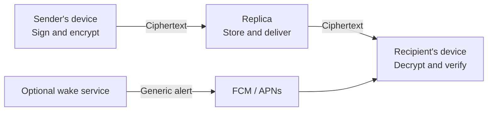

# elo.now

**Built by [9bits](https://9bits.com).**

[English](#english) · [Polski](#polski)

## English

### 1 man, 1 week, 1 GPT Astra

elo.now started with an idea: team conversations should be easy to organize, and the people having them should control their data.

One person at 9bits, working with GPT Astra, took elo.now from an idea to a working MVP in one week. Product decisions, interface design, the Rust core, mobile clients and real-device testing grew together in one fast development cycle. This was not just a set of mockups: people could create profiles, join Spaces, exchange encrypted messages and receive notifications on a phone.

We are sharing the application source so others can see how it works, inspect the trade-offs and help improve it. One week brought us to a working MVP, not the end of development or a completed independent security audit.

### The application

elo.now is a messaging app for small groups and teams. A **Space** keeps one group's people and conversations together. Inside it you can chat in channels or directly, share encrypted photos and files, and make voice or video calls. The same app runs on iPhone, Android and desktop.

### Start in five steps

1. Install elo.now, choose **New with elo?**, enter your name and set a password. Save the recovery code somewhere safe; it is how you recover your identity if you lose the device.
2. Choose **Create a Space**, give it a name and enter a contact email. You become its primary owner. The **General** conversation is ready automatically.
3. In **Spaces**, tap the Share icon beside your Space. Send its QR code or invitation link to someone you trust.
4. That person chooses **Join a Space** and scans the code or opens the link. If the invitation requires approval, approve their request in **Approvals**.
5. Open **General** to send your first message. Add other channels or start a direct conversation as needed. You can enable notifications in Settings.

Joining someone else's group? Start at step 1, then choose **Join a Space** instead of creating one. A recovery code restores your identity; use a separate encrypted backup if you also need to restore supported chat history.

## Download

- [iPhone on the App Store](https://apps.apple.com/app/id6814766127)
- [Android on Google Play](https://play.google.com/store/apps/details?id=now.elo)
- [Desktop releases for macOS, Windows and Linux](https://github.com/elo-now/elo-now/releases)

Store links become available after the respective store approves and releases the app. Check the desktop release notes for supported architectures and signing status.

## In the app

- **Spaces:** switch between organizations, join by invitation or QR, and keep each Space's conversations separate. Owners can approve join requests.
- **Conversations:** channels, group and direct messages, replies, reactions, pins, encrypted file and photo attachments, and search. Each Space has a General channel.
- **Calls:** voice and video calls, optional background incoming calls on mobile, and screen sharing on desktop.
- **Buzz:** catch up on unread messages. Mute a conversation to exclude it from Buzz and message notifications.
- **Notifications:** optional mobile system notifications, quiet follow-up alerts while messages remain unread, and links to the relevant conversation.
- **Your profile:** password or supported biometric unlocking, device linking, recovery codes and password-protected recovery QR images.
- **Appearance:** color schemes, background motifs (including a motif you draw), opacity and interface size.
- **Backups:** encrypted exports of supported profile and conversation data. Attachment bytes are excluded. The 64 MiB budget is measured before compression and encryption; older message groups may be omitted to fit.

English is the currently supported interface language. Publisher-operated hosting allows two Spaces per creator identity, with 150 MB of encrypted message storage and a separate 50 MB attachment quota in each Space. The application is under active development. Publishing these sources does not mean that public app-store releases or an independent security audit have been completed.

## How data moves

A **Space** is an organizational context: a company or team with its own access and conversations. A **Replica** is a storage and delivery server. They are different concepts; changing a server does not by itself define who belongs to a conversation.

1. Before encrypting new content in a hosted Space, the app checks a short-lived confirmation of chat permissions from its pinned host. Normal synchronization refreshes these confirmations in batches; each message does not require a separate request. Known permission changes invalidate the cached result immediately. If no valid confirmation is available, sending waits for the host. The Rust core signs and encrypts the message for the authorized device keys.
2. The device uploads the encrypted object to a configured Replica. The Replica stores ciphertext and delivery metadata rather than the message text.
3. Recipients synchronize the encrypted object, decrypt it on their own devices and verify its signature and authorization before accepting it.
4. With system notifications enabled, a separate wake service sends a generic alert through Firebase Cloud Messaging and APNs. The current push payload does not include the message text or conversation name; its routing target is encrypted. Opening the alert takes the app to the relevant conversation.



Profiles and conversation history are kept on participating devices. A Space enrollment service handles joining and General membership. Joining General gives access to new messages; it does not automatically reveal earlier history. Recovery codes restore identity, while separately exported encrypted backups restore supported conversation data.

**Security limits:** recovery alone does not revoke a lost device. Hosted sends require current server-confirmed permissions; unavailable hosts pause sending. Revocation cannot erase existing copies, and there is no forward secrecy for retained message objects. Standalone mode and older deployed versions have different guarantees. Read the [threat model](THREAT_MODEL.md) before relying on these protections.

### Where attachments and calls go

Files are encrypted on the sender's device before upload. The hosting operator chooses where to keep the encrypted file bytes: local storage, MEGA through WebDAV, or S3-compatible object storage. Publisher-operated hosting currently uses MEGA. Attachment storage does not need the file decryption keys. Individual files are limited to 5 MB on publisher-operated hosting.

Calls use a separate authorization and control service. Direct calls try an authenticated WebRTC connection between devices and can use a TURN relay when a direct route is unavailable. Group calls use a LiveKit media server (SFU). The messaging Replica does not store call audio or video. The app discovers the call service through its configured Space endpoint; server placement is the hosting operator's choice.

### Security, with clear boundaries

The design uses Ed25519 signatures, the age encryption format and HTTPS transport. A storage Replica does not need participants' decryption keys to deliver their messages. Passwords, recovery secrets and server administrator credentials do not belong in a source repository or notification payload.

These protections have limits. Servers and notification providers can observe some metadata, including timing, object sizes or delivery information. Authorized recipients can copy content, and a compromised unlocked device can expose it. The current design uses long-term recipient keys, without a messaging ratchet or a guarantee of forward secrecy. The General enrollment service holds an authorized participant key for General, so organizational administrators are part of its trust model.

Newly linked and recovered devices receive independent keys. To link a device, show the QR from **Devices → +**, scan it on the new device, then choose **Accept** on the original device. The new device opens the transferred profile with the same password. Keep this QR private. An unlocked, admitted device can revoke another device through **Delete** and confirmation. Server confirmation is required, private-chat controllers must update recipient keys, and copies already on a device cannot be erased. These protocol changes require matching app and server versions; see the [threat model](THREAT_MODEL.md) for rollout boundaries and remaining risks.

This is an actively developed MVP. Open source makes the implementation available for inspection; it is not proof that every component has been audited or that the application is immune to vulnerabilities.

### Server and app updates

App releases and server API versions are separate. The next security baseline is a clean cutover without support for previous clients or migration of existing runtime data. Later compatible releases preserve their supported contracts. The new source checks for updates in the background without delaying access to local profiles or saved chats. Required updates are disabled by default on the server and have separate minimum versions for each platform. When required, a single-line orange banner stays below the header and new online actions pause; local features remain available. Users install updates from their store or the desktop releases page. Existing store builds do not acquire this mechanism automatically. See [API compatibility and updates](docs/API_COMPATIBILITY.md) for configuration and rollout, and [self-hosting](docs/SELF_HOSTING.md) for the installation guide.

## Polski

### 1 człowiek, 1 tydzień, 1 GPT Astra

elo.now zaczęło się od pomysłu: rozmowy zespołu powinny być łatwe do uporządkowania, a osoby, które je prowadzą, powinny mieć kontrolę nad swoimi danymi.

Jedna osoba w [9bits](https://9bits.com), pracując z GPT Astra, przeszła od pomysłu do działającego MVP elo.now w tydzień. Decyzje produktowe, projekt interfejsu, rdzeń w Ruście, aplikacje mobilne i testy na prawdziwym telefonie powstawały w jednym krótkim cyklu. Powstały nie tylko makiety: można było założyć profil, dołączyć do Space, wymieniać zaszyfrowane wiadomości i odbierać powiadomienia na telefonie.

Udostępniamy kod aplikacji, żeby można było sprawdzić, jak działa, poznać przyjęte kompromisy i pomóc w jej rozwoju. Tydzień wystarczył na działające MVP. Nie oznacza to zakończenia rozwoju ani przeprowadzenia niezależnego audytu bezpieczeństwa.

### Co to za aplikacja?

elo.now to otwarty komunikator zespołowy na iOS, Androida i desktop. **Spaces** rozdzielają konteksty różnych firm i zespołów. W każdym można korzystać z kanałów, General i rozmów bezpośrednich, odpowiadać na wiadomości, dodawać reakcje, przypinać treści, wysyłać zaszyfrowane pliki i zdjęcia oraz prowadzić rozmowy głosowe i wideo. Na desktopie można udostępniać ekran.

**Buzz** zbiera nieprzeczytane wiadomości. Wyciszona rozmowa nie dodaje wiadomości do Buzz i nie wysyła powiadomień o nich. Aplikacja oferuje również przypomnienia, wyszukiwanie, łączenie urządzeń, odzyskiwanie profilu oraz wybór kolorów i motywów, także własnoręcznie narysowanego. Hosting wydawcy pozwala utworzyć dwa Spaces na tożsamość: każdy ma 150 MB na zaszyfrowane wiadomości i osobny limit 50 MB na załączniki. Obecnie obsługiwanym językiem interfejsu jest angielski.

### Jak przepływają dane?

**Space** to przestrzeń organizacji z dostępem do jej rozmów. **Replika** to serwer przechowujący i dostarczający dane. To nie jest to samo: sam adres serwera nie określa, kto może czytać daną rozmowę.

1. Urządzenie nadawcy podpisuje wiadomość i szyfruje ją dla uprawnionych odbiorców.
2. Replika otrzymuje zaszyfrowany obiekt. Przechowuje szyfrogram i informacje potrzebne do dostarczenia go, zamiast treści wiadomości.
3. Urządzenie odbiorcy pobiera obiekt, odszyfrowuje go oraz sprawdza podpis i uprawnienia.
4. Opcjonalna usługa powiadomień wysyła ogólny alert przez Firebase Cloud Messaging i APNs. Obecny push nie zawiera tekstu wiadomości ani nazwy rozmowy, a dane wskazujące rozmowę są zaszyfrowane.

Profile i historia są przechowywane na urządzeniach uczestników. Osobna usługa Space obsługuje dołączanie i członkostwo w General. Nowa osoba otrzymuje dostęp do nowych wiadomości; wcześniejsza historia nie jest udostępniana automatycznie.

Kod recovery odzyskuje tożsamość, nie całą historię. Do przeniesienia obsługiwanych danych rozmów służy osobny, zaszyfrowany backup. Backup nie zawiera zawartości załączników. Jego limit wynosi 64 MiB danych przed kompresją i szyfrowaniem; najstarsze grupy wiadomości mogą zostać pominięte, aby zmieścić eksport w limicie.

### Co chronimy, a czego nie obiecujemy?

Wykorzystujemy podpisy Ed25519, format szyfrowania age i transport HTTPS. Replika przechowująca dane nie potrzebuje kluczy uczestników do odszyfrowania wiadomości. Hasła, kody recovery i dane administratora nie są częścią publikowanych źródeł ani powiadomień.

Szyfrowanie nie ukrywa wszystkich metadanych. Serwery i dostawcy powiadomień mogą widzieć m.in. czas transmisji, rozmiary obiektów czy informacje o dostarczeniu. Odbiorca może skopiować otrzymaną treść, a przejęte, odblokowane urządzenie może ujawnić dane. Obecny mechanizm korzysta z długoterminowych kluczy odbiorców: nie ma ratchetu komunikatora ani gwarancji forward secrecy. Usługa dołączania do General posiada klucz uprawnionego uczestnika tego kanału, dlatego administrator organizacji jest częścią modelu zaufania.

Nie obiecujemy „stuprocentowego bezpieczeństwa”. Kod jest otwarty i dostępny do sprawdzenia, ale sam fakt publikacji nie zastępuje niezależnego audytu. Aplikacja pozostaje aktywnie rozwijanym MVP.

**Projekt tworzy [9bits](https://9bits.com).** Kod aplikacji udostępniamy na licencji **AGPL-3.0-only**; zależności zachowują własne licencje.

## Build and test

See [Building from source](docs/BUILDING.md) for prerequisites, local startup, native project setup and optional notification configuration.

### Run your own Space host

For a private installation, start with **one VPS and one HTTPS origin**. Build the `elo-team` hosted-Space service on the VPS, keep its data and private configuration on that server, and set `TAURI_ELO_API_URL=https://chat.example.org` when building the app. The app uses that origin for Space creation; it does not need your VPS login or storage-provider password. The default source build points to `https://api.elo.now`, so set the override for a self-hosted build.

The [complete single-VPS installation guide](docs/SELF_HOSTING.md) covers service configuration, attachment storage, TLS routes, calls, notifications and operational checks. Encrypted attachments can stay on the VPS or use a private MEGA WebDAV or S3-compatible provider. Their credentials never belong in the app.

```sh
cd apps/desktop
npm ci
npm run tauri -- dev
```

The default source build contains the public service origin described above, but no demo access credentials, private server configuration, Firebase project configuration or signing identities. Use a local profile/demo or connect to a Space prepared by its operator.

## Repository layout

| Path | Contents |
| --- | --- |
| `apps/desktop` | Shared React interface and Tauri desktop/mobile application |
| `crates/elo-core` | Identity, cryptography, messaging, storage, synchronization and Replica implementation |
| `crates/elo-cli` | Command-line tools and Replica entry point |
| `crates/elo-team` | Space enrollment and General membership service |
| `crates/elo-call-service` | Call signaling and authorization service |
| `crates/elo-wake` | Optional notification delivery service |
| `crates/tauri-plugin-elo-push` | Native iOS and Android push integration |
| `migrations`, `protocol` | Database migrations and deterministic protocol test fixtures |
| `vendor/tauri-plugin-notification` | Bundled notification plugin with local fixes and upstream licenses |

This repository contains application source and build resources. The marketing website, brandbook, internal decisions, development conversations, private notes, operational configurations, user profiles, signing credentials and compiled packages are not part of it. Deterministic test fixtures and test-only passwords are public test data; never use them for real accounts.

## License

Project code is licensed under **AGPL-3.0-only**. See the full [LICENSE](LICENSE). Third-party components retain their own licenses, including the notices under `apps/desktop/public/licenses`, `apps/desktop/public/brand` and `vendor/tauri-plugin-notification`.

## Reporting security problems

Do not put recovery material, passwords, keys, private messages, server capabilities or memory dumps in issues. Use synthetic data for public bug reports. A monitored private security reporting contact and response policy have not yet been designated; no response-time commitment is made here.
