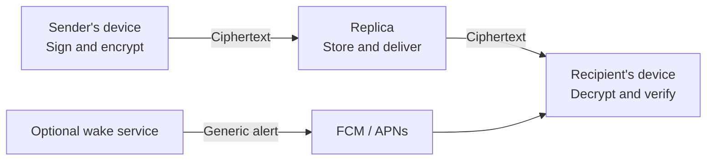

# elo.now

**Built by [9bits](https://9bits.com).**

[English](#english) · [Polski](#polski)

## English

### From idea to a working MVP in five days with GPT 6 Astra.

elo.now started with an idea: team conversations should be easy to organize, and the people having them should control their data.

At 9bits, we developed elo.now with GPT 6 Astra, taking the idea to a working MVP in five days. Product decisions, interface design, the Rust core, mobile clients and real-device testing grew together in one fast development cycle. This was not just a set of mockups: people could create profiles, join Spaces, exchange encrypted messages and receive notifications on a phone.

We are sharing the application source so others can see how it works, inspect the trade-offs and help improve it. Five days brought us to a working MVP, not the end of development or a completed independent security audit.

### The application

Open-source team messaging with separate Spaces, channels and direct messages. The shared Rust core powers the iOS, Android and desktop clients, with a React and TypeScript interface in Tauri.

## In the app

- **Spaces:** switch between organizations, join by invitation or QR, and keep each Space's conversations separate. Owners can approve join requests.
- **Conversations:** channels, group and direct messages, replies, reactions, pins, file sharing and search. Each Space has a General channel.
- **Buzz:** catch up on unread messages. Mute a conversation to exclude it from Buzz and message notifications.
- **Notifications:** optional mobile system notifications, quiet follow-up alerts while messages remain unread, and links to the relevant conversation.
- **Your profile:** password or supported biometric unlocking, device linking, recovery codes and password-protected recovery QR images.
- **Appearance:** color schemes, background motifs, opacity and interface size.
- **Backups:** encrypted exports of supported profile and conversation data. Attachment bytes are excluded. The 64 MiB budget is measured before compression and encryption; older message groups may be omitted to fit.

English is the currently supported interface language. The application is under active development. Publishing these sources does not mean that public app-store releases or an independent security audit have been completed.

## How data moves

A **Space** is an organizational context: a company or team with its own access and conversations. A **Replica** is a storage and delivery server. They are different concepts; changing a server does not by itself define who belongs to a conversation.

1. A sender creates a message on their device. The Rust core signs it and encrypts it for the authorized recipients.
2. The device uploads the encrypted object to a configured Replica. The Replica stores ciphertext and delivery metadata rather than the message text.
3. Recipients synchronize the encrypted object, decrypt it on their own devices and verify its signature and authorization before accepting it.
4. With system notifications enabled, a separate wake service sends a generic alert through Firebase Cloud Messaging and APNs. The current push payload does not include the message text or conversation name; its routing target is encrypted. Opening the alert takes the app to the relevant conversation.



Profiles and conversation history are kept on participating devices. A Space enrollment service handles joining and General membership. Joining General gives access to new messages; it does not automatically reveal earlier history. Recovery codes restore identity, while separately exported encrypted backups restore supported conversation data.

### Security, with clear boundaries

The design uses Ed25519 signatures, the age encryption format and HTTPS transport. A storage Replica does not need participants' decryption keys to deliver their messages. Passwords, recovery secrets and server administrator credentials do not belong in a source repository or notification payload.

These protections have limits. Servers and notification providers can observe some metadata, including timing, object sizes or delivery information. Authorized recipients can copy content, and a compromised unlocked device can expose it. The current design uses long-term recipient keys, without a messaging ratchet or a guarantee of forward secrecy. The General enrollment service holds an authorized participant key for General, so organizational administrators are part of its trust model.

This is an actively developed MVP. Open source makes the implementation available for inspection; it is not proof that every component has been audited or that the application is immune to vulnerabilities.

## Polski

### Od pomysłu do działającego MVP w pięć dni z GPT 6 Astra.

elo.now zaczęło się od pomysłu: rozmowy zespołu powinny być łatwe do uporządkowania, a osoby, które je prowadzą, powinny mieć kontrolę nad swoimi danymi.

W [9bits](https://9bits.com) rozwijaliśmy elo.now z GPT 6 Astra, przechodząc od pomysłu do działającego MVP w pięć dni. Decyzje produktowe, projekt interfejsu, rdzeń w Ruście, aplikacje mobilne i testy na prawdziwym telefonie powstawały w jednym krótkim cyklu. Powstały nie tylko makiety: można było założyć profil, dołączyć do Space, wymieniać zaszyfrowane wiadomości i odbierać powiadomienia na telefonie.

Udostępniamy kod aplikacji, żeby można było sprawdzić, jak działa, poznać przyjęte kompromisy i pomóc w jej rozwoju. Pięć dni wystarczyło na działające MVP. Nie oznacza to zakończenia rozwoju ani przeprowadzenia niezależnego audytu bezpieczeństwa.

### Co to za aplikacja?

elo.now to otwarty komunikator zespołowy na iOS, Androida i desktop. **Spaces** rozdzielają konteksty różnych firm i zespołów. W każdym można korzystać z kanałów, General i rozmów bezpośrednich, odpowiadać na wiadomości, dodawać reakcje, przypinać treści i wysyłać pliki.

**Buzz** zbiera nieprzeczytane wiadomości. Wyciszona rozmowa nie dodaje wiadomości do Buzz i nie wysyła powiadomień o nich. Aplikacja oferuje również przypomnienia, wyszukiwanie, łączenie urządzeń, odzyskiwanie profilu oraz wybór kolorów i motywów. Obecnie obsługiwanym językiem interfejsu jest angielski.

### Jak przepływają dane?

**Space** to przestrzeń organizacji z dostępem do jej rozmów. **Replika** to serwer przechowujący i dostarczający dane. To nie jest to samo: sam adres serwera nie określa, kto może czytać daną rozmowę.

1. Urządzenie nadawcy podpisuje wiadomość i szyfruje ją dla uprawnionych odbiorców.
2. Replika otrzymuje zaszyfrowany obiekt. Przechowuje szyfrogram i informacje potrzebne do dostarczenia go, zamiast treści wiadomości.
3. Urządzenie odbiorcy pobiera obiekt, odszyfrowuje go oraz sprawdza podpis i uprawnienia.
4. Opcjonalna usługa powiadomień wysyła ogólny alert przez Firebase Cloud Messaging i APNs. Obecny push nie zawiera tekstu wiadomości ani nazwy rozmowy, a dane wskazujące rozmowę są zaszyfrowane.

Profile i historia są przechowywane na urządzeniach uczestników. Osobna usługa Space obsługuje dołączanie i członkostwo w General. Nowa osoba otrzymuje dostęp do nowych wiadomości; wcześniejsza historia nie jest udostępniana automatycznie.

Kod recovery odzyskuje tożsamość, nie całą historię. Do przeniesienia obsługiwanych danych rozmów służy osobny, zaszyfrowany backup. Backup nie zawiera zawartości załączników. Jego limit wynosi 64 MiB danych przed kompresją i szyfrowaniem; najstarsze grupy wiadomości mogą zostać pominięte, aby zmieścić eksport w limicie.

### Co chronimy, a czego nie obiecujemy?

Wykorzystujemy podpisy Ed25519, format szyfrowania age i transport HTTPS. Replika przechowująca dane nie potrzebuje kluczy uczestników do odszyfrowania wiadomości. Hasła, kody recovery i dane administratora nie są częścią publikowanych źródeł ani powiadomień.

Szyfrowanie nie ukrywa wszystkich metadanych. Serwery i dostawcy powiadomień mogą widzieć m.in. czas transmisji, rozmiary obiektów czy informacje o dostarczeniu. Odbiorca może skopiować otrzymaną treść, a przejęte, odblokowane urządzenie może ujawnić dane. Obecny mechanizm korzysta z długoterminowych kluczy odbiorców: nie ma ratchetu komunikatora ani gwarancji forward secrecy. Usługa dołączania do General posiada klucz uprawnionego uczestnika tego kanału, dlatego administrator organizacji jest częścią modelu zaufania.

Nie obiecujemy „stuprocentowego bezpieczeństwa”. Kod jest otwarty i dostępny do sprawdzenia, ale sam fakt publikacji nie zastępuje niezależnego audytu. Aplikacja pozostaje aktywnie rozwijanym MVP.

**Projekt tworzy [9bits](https://9bits.com).** Kod aplikacji udostępniamy na licencji **AGPL-3.0-only**; zależności zachowują własne licencje.

## Build and test

See [Building from source](docs/BUILDING.md) for prerequisites, local startup, native project setup and optional notification configuration.

```sh
cd apps/desktop
npm ci
npm run tauri -- dev
```

The default source build does not include a hosted Demo's access credentials, live server endpoints, Firebase configuration or signing identities. Use a local profile/demo or connect to a Space prepared by its operator.

## Repository layout

| Path | Contents |
| --- | --- |
| `apps/desktop` | Shared React interface and Tauri desktop/mobile application |
| `crates/elo-core` | Identity, cryptography, messaging, storage, synchronization and Replica implementation |
| `crates/elo-cli` | Command-line tools and Replica entry point |
| `crates/elo-team` | Space enrollment and General membership service |
| `crates/elo-wake` | Optional notification delivery service |
| `crates/tauri-plugin-elo-push` | Native iOS and Android push integration |
| `migrations`, `protocol` | Database migrations and deterministic protocol test fixtures |
| `vendor/tauri-plugin-notification` | Bundled notification plugin with local fixes and upstream licenses |

This repository contains application source and build resources. The marketing website, brandbook, internal decisions, development conversations, private notes, operational configurations, user profiles, signing credentials and compiled packages are not part of it. Deterministic test fixtures and test-only passwords are public test data; never use them for real accounts.

## License

Project code is licensed under **AGPL-3.0-only**. See the full [LICENSE](LICENSE). Third-party components retain their own licenses, including the notices under `apps/desktop/public/licenses`, `apps/desktop/public/brand` and `vendor/tauri-plugin-notification`.

## Reporting security problems

Do not put recovery material, passwords, keys, private messages, server capabilities or memory dumps in issues. Use synthetic data for public bug reports. A monitored private security reporting contact and response policy have not yet been designated; no response-time commitment is made here.
