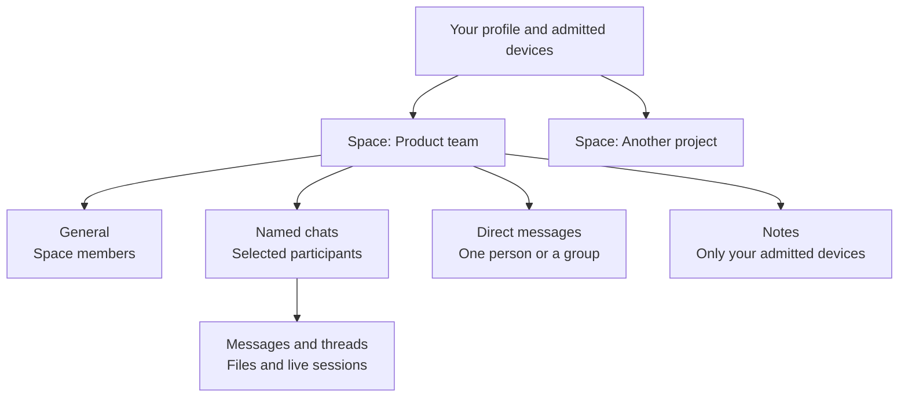
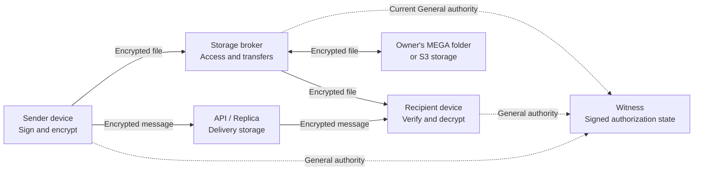

# elo.now

**Private team communication. On your terms.**

elo.now brings conversations, files and live audio/video sessions together in
Spaces. It is an open-source communication platform for teams that want to
understand how their data is handled and have the option to operate their own
infrastructure. Built by [9bits](https://9bits.com).

[iOS](https://apps.apple.com/app/id6814766127) ·
[Android](https://play.google.com/store/apps/details?id=now.elo) ·
[macOS, Windows and Linux](https://github.com/elo-now/elo-now/releases) ·
[Build from source](docs/BUILDING.md) · [Self-host](docs/SELF_HOSTING.md)

See the release notes for supported platforms, architectures and package signing.

## Your team's workspace, managed by 9bits

Get a private elo workspace ready for your organization, with help from the team
behind the application. **9bits can install and configure elo on your own
infrastructure, or host and manage it for you.**

- **A setup that fits your team:** Spaces, access and attachment storage configured
  around the way you work.
- **Your choice of infrastructure:** a deployment on your servers or hosting
  provided by 9bits.
- **Ongoing care:** updates, monitoring, backups and support.

[Talk to 9bits](mailto:contact@9bits.com) about your organization and we will help
you choose a setup and prepare an offer.

In **Create Space**, choose the included **elo.now** hosting or import a private
hosting configuration by QR or link. The hosting catalog stays on your device;
each Space uses its selected services and supported retention policy. Private
operators can offer 24 hours, 48 hours or no automatic server expiry, and managed
attachment storage without putting storage credentials in the QR. See
[hosting profiles](docs/SELF_HOSTING.md#imported-hosting-profiles),
[two-host Docker installer](deploy/containers/README.md) and
[hosting administration panel](deploy/admin/README.md) for installation,
supported services and trust boundaries.

## Work together

| Area                             | What you can do                                                                                                                                                                                |
| -------------------------------- | ---------------------------------------------------------------------------------------------------------------------------------------------------------------------------------------------- |
| **Spaces**                       | Keep organizations and projects separate, invite people by link or QR, and choose whether an invitation requires owner approval.                                                               |
| **Conversations**                | Use General, named chats, one-to-one and group DMs; reply in threads, mention teammates, edit your text, react, pin and search available messages.                                             |
| **Buzz**                         | Catch up through **All**, **Mentions** and **Threads**. Follow a thread or mute a conversation to control your attention.                                                                      |
| **Notes and drafts**             | Send notes and files to yourself in a private conversation shared with your admitted devices. Unsent drafts stay encrypted on the device where you write them.                                 |
| **Attachments**                  | Share encrypted photos and files, paste image bytes or drop a file into a desktop chat, and view downloaded images in the conversation.                                                        |
| **Audio and video**              | Start or join a session from a chat, use full-screen video, choose the audio output on mobile and share your screen on desktop. Sessions are voluntary: they do not ring like telephone calls. |
| **Devices and recovery**         | Link and approve devices, manage registered access, unlock with a password or supported biometrics, and export encrypted backups of supported profile and chat data.                           |
| **Notifications and appearance** | Use optional system notifications, unread indicators and desktop notification sounds; choose Dark, Auto or Light, interface size and background motifs.                                        |
| **Retention**                    | Choose the Space's server message lifetime, set **Keep** on individual text messages and set a separate attachment expiry policy.                                                              |

Live synchronization uses authenticated WebSocket connections. Typing indicators,
online status and upload previews provide context while connected; ordinary
synchronization catches up after reconnecting. A storage acknowledgment is not a
receipt proving that another person received or read a message.

The shared application supports iPhone, Android and desktop. English is the
currently supported interface language. Native capabilities and distribution
signing vary by platform; see [building and platform requirements](docs/BUILDING.md).

## How Spaces organize conversations

A profile is your identity across its admitted devices. A **Space** brings a
particular organization's or project's members and conversations together.
Joining a Space admits you to its General conversation; other chats have their
own participants and permissions. Space membership does not automatically let
you read every private conversation or earlier history.


```mermaid
flowchart TD
    P["Your profile and admitted devices"] --> A["Space: Product team"]
    P --> B["Space: Another project"]
    A --> G["General<br/>Space members"]
    A --> C["Named chats<br/>Selected participants"]
    A --> D["Direct messages<br/>One person or a group"]
    A --> N["Notes<br/>Only your admitted devices"]
    C --> T["Messages and threads<br/>Files and live sessions"]
```

Each profile has its own Notes conversation in a Space. Personal chat groups
organize your list; moving a chat into a group does not change its membership.
Details and device-admission limits are in [chat groups and Notes](docs/CHAT_GROUPS.md).

### Get started

1. Install the app, choose **New with elo?**, enter your name and set a password.
   Save your recovery code somewhere safe.
2. **Create a Space**, set its name and server message lifetime, and choose whether
   the initial invitation requires owner approval. General is created for you.
   In a deployment with the attachment broker, attachments start disabled; the
   owner can enable and configure them during creation or later in Space settings.
3. Share the Space's invitation QR or link with people you trust. They choose
   **Join a Space**; approval-required requests appear in the owner's **Approvals**.
4. Open General, create other conversations and configure notifications as needed.

A recovery code restores identity, not all chat history. A separate encrypted
backup restores supported profile and conversation data, without attachment
bytes. Its 64 MiB budget is measured before compression and encryption; older
message groups may be omitted to fit. Keep backups independently of your device.

## How data moves

A **Replica** is a delivery store, not a Space or a guaranteed archive. Its
retention follows the Space's selected hosting policy. Devices
sign messages and encrypt them for authorized device keys before upload.
Recipients decrypt locally and verify the signature and authorization before
accepting a message. Hosted sending also requires fresh authorization evidence;
unavailable services can pause new sends even though saved local history remains
readable.

The following diagram shows message and attachment paths in a deployment with
the separately provisioned witness and storage broker. Dashed arrows represent
authorization checks, not message content.


```mermaid
flowchart LR
    A["Sender device<br/>Sign and encrypt"] -->|Encrypted message| R["API / Replica<br/>Delivery storage"]
    R -->|Encrypted message| B["Recipient device<br/>Verify and decrypt"]
    A -.->|General authority| W["Witness<br/>Signed authorization state"]
    B -.->|General authority| W
    A -->|Encrypted file| S["Storage broker<br/>Access and transfers"]
    S <-->|Encrypted file| F["Owner's MEGA folder<br/>or S3 storage"]
    S -->|Encrypted file| B
    S -.->|Current General authority| W
```

Other traffic has separate paths:

- **Notifications:** the wake service sends generic alerts through Firebase Cloud
  Messaging and APNs. Current push payloads omit message text and conversation
  names; their navigation target is encrypted. Providers still process tokens
  and delivery metadata. Desktop notifications require the app to remain running
  and unlocked; they do not wake a closed desktop application.
- **Audio, video and screen sharing:** direct sessions prefer authenticated
  WebRTC between devices, with TURN relay fallback. Group sessions use a LiveKit
  media server with additional end-to-end media encryption. Media does not pass
  through the message Replica and is not stored there. Call infrastructure still
  sees connection and session metadata. See [calls and media boundaries](docs/CALLS.md).

### What the witness does

The witness is a separate authorization service for witnessed **General**
membership changes. It verifies owner-signed policies and proposals, serializes
accepted changes and provides signed freshness evidence. An open invitation can
admit its holder while the owner is offline, within the owner's registered
policy; approval-required invitations still need owner approval.

This adds a verification boundary outside the API host. It is not a universal
validator for every private-chat action, and it does not hold message decryption
keys. Clients must receive the witness's trust pin independently of the API.
Hosting the two services under one provider account leaves a shared compromise
and recovery risk. Witness-host compromise, lost signing keys and rollback
recovery require their own protections; see [witness deployment and recovery](deploy/witness/README.md).

### Connect your own attachment storage

The Space owner enables attachments and selects
**MEGA** or **S3-compatible storage** during creation or in Space settings. MEGA
uses a dedicated writable folder link and write authorization, not the account
password. S3 uses credentials restricted to the intended bucket and prefix.
An owner's MEGA account still uses MEGA's infrastructure; it is not a server
physically owned by the user.

The client sends provider configuration directly to the separate storage broker.
The Space API does not receive those credentials. The broker retains encrypted
provider configuration and uses it to transfer encrypted files; it does not need
the file decryption keys. An attacker controlling the broker host could still
obtain provider credentials or delete ciphertext within their scope. Use a
dedicated folder or bucket with limited permissions.

Changing providers affects new uploads. Existing objects retain their original
provider and expiry; disabling attachments stops new uploads while existing
objects remain downloadable until expiry. The broker enforces a 5 MiB file limit
and a 50,000,000-byte Space quota.
See the [storage broker contract](crates/elo-storage/README.md).

## Three different expiry settings

| Setting                     | Choices                                           | What it controls                                                                                                                                         |
| --------------------------- | ------------------------------------------------- | -------------------------------------------------------------------------------------------------------------------------------------------------------- |
| **Server message lifetime** | Public elo.now: **6 h / 12 h / 24 h**, default **24 h**; private hosting: its advertised policies | How long the Replica retains an encrypted message body, measured from server receipt. It does not erase history already on devices.                      |
| **Keep** on a text message  | **No expiry / 1 h / 24 h**, default **No expiry** | When updated clients hide that message's content and show **Message expired**. The composer represents No expiry as **∞**.                               |
| **Attachment expiry**       | **1 h / 12 h / 24 h**, default **1 h**            | When the attachment stops being downloadable and its encrypted object becomes due for deletion from storage. New policy choices apply to future uploads. |

With a finite server lifetime, a one-to-one DM body can leave the Replica earlier:
after one device of the other identity verifies and durably accepts it. This is
not a human read receipt, and another device of that identity may still need to
retrieve a copy. **No expiry** does not remove the body on this acknowledgment.

Server expiry does **not** mean all Space data disappears. Encrypted locators,
authorization and membership state, operational metadata, logs and backups have
separate lifecycles. After a long offline period, **Retrieve** may require a
current member's app to be online, unlocked and still holding the message. If no
copy remains, the content cannot be recovered.

Use a sent message's **Keep** menu to change or remove its deadline before expiry.
A new duration starts when saved. Replies have independent deadlines. Expiry is
an application visibility rule, not verified erasure from every device, signed
record, backup or external copy. Downloaded attachment copies can remain on a
device; failed provider deletion is retried in the background.
See [message retention and retrieval](docs/REPLICA_RETENTION.md) for the full contract.

## Privacy with explicit boundaries

elo uses Ed25519 signatures, age encryption for message objects and HTTPS
transport. In the current owner-managed General design, the API and Replica do
not hold General content decryption keys. This does not retroactively remove
keys from legacy version-1 Spaces. The app does not include a service that sends
conversation content to an AI assistant or model for processing; a participant
can still copy or export content to another tool.

Encryption does not eliminate metadata processing. Depending on the service and
deployment, operators process IP addresses and abuse-prevention hashes,
identifiers, sizes and delivery times, notification registrations and routing,
Space membership and chosen names, and public device keys and permissions.
Call and storage providers also observe their respective connection or transfer
metadata. Retention differs across databases, logs and backups. Read the
[privacy policy](https://elo.now/privacy/) for the publisher-operated service and
the [current in-app legal text](apps/desktop/src/locales/legal.en.json); a
self-hosting operator must document its own infrastructure and data practices.

Important limits remain:

- Authorized recipients can copy content, and a compromised unlocked device can
  expose it. Revoking access cannot erase copies already obtained.
- Message encryption currently uses long-term recipient keys, without a messaging
  ratchet, forward secrecy for retained message objects or post-compromise security.
- Recovery alone does not revoke a lost device. Device admission, Notes controller
  access and revocation have the limits described in the linked technical docs.
- An independent security audit has not been completed. Passing tests and public
  code are not a guarantee of availability or immunity to vulnerabilities.

Read the [threat model](THREAT_MODEL.md) and the component contracts before relying
on a particular guarantee. They distinguish legacy, baseline and witnessed paths.

## Build and operate

```sh
cd apps/desktop
npm ci
npm run tauri -- dev
```

[Building from source](docs/BUILDING.md) covers toolchains, native setup and
platform requirements. Set `TAURI_ELO_API_URL` for your own deployment; the default
source build uses `https://api.elo.now` without private credentials or demo access.
Compiled clients must match the services they use.

The [single-VPS guide](docs/SELF_HOSTING.md) describes the baseline installation
without an independent witness. Witnessed General and the attachment broker
require a separate host, explicit client/service trust pins and their documented
activation and acceptance checks. Setting an API URL alone does not enable them.
Use the [witness guide](deploy/witness/README.md) and
[broker guide](crates/elo-storage/README.md) for that path.

Deploy compatible client and server versions together. Review
[API compatibility and release policy](docs/API_COMPATIBILITY.md) before changing
a deployment, and keep minimum-version requirements aligned with distributed
applications. Private service credentials and signing identities never belong
in distributed app binaries or this repository.

## Repository layout

| Path                           | Contents                                                                  |
| ------------------------------ | ------------------------------------------------------------------------- |
| `apps/desktop`                 | Shared React interface and Tauri desktop/mobile application               |
| `crates/elo-core`              | Identity, cryptography, authority, messaging, synchronization and Replica |
| `crates/elo-cli`               | Command-line tools and Replica entry point                                |
| `crates/elo-team`              | Hosted Spaces, enrollment and General coordination                        |
| `crates/elo-witness`           | Independent witnessed-General authorization service                       |
| `crates/elo-storage`           | Independent encrypted-attachment storage broker                           |
| `crates/elo-call-service`      | Session signaling and authorization                                       |
| `crates/elo-wake`              | Optional notification delivery                                            |
| `crates/tauri-plugin-elo-push` | Native mobile notification integration                                    |
| `migrations`, `protocol`       | Database migrations and deterministic protocol fixtures                   |
| `landingpage`                  | Static website, public legal pages and website assets                     |
| `tools`                        | Build, validation, packaging and website-generation scripts               |

The published repository contains application source, build resources and the
static website with its generator and example publishing configuration. Internal
notes, live publishing and operational configurations, user profiles, signing
credentials and compiled packages are excluded from source packaging.
Deterministic test fixtures and test-only passwords are public test data; never
use them for real accounts.

## License and security reports

Project code is **AGPL-3.0-only**; see [LICENSE](LICENSE). Third-party components
retain their own licenses, including the notices in `apps/desktop/public/licenses`,
`apps/desktop/public/brand` and `vendor`.

Do not put recovery material, passwords, keys, private messages, server
capabilities or memory dumps in public issues. Use synthetic data for bug reports.
Report suspected vulnerabilities privately using the contact and instructions in
[SECURITY.md](SECURITY.md). No response-time commitment or independent security
certification is made there.
